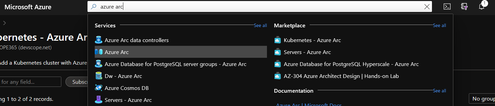
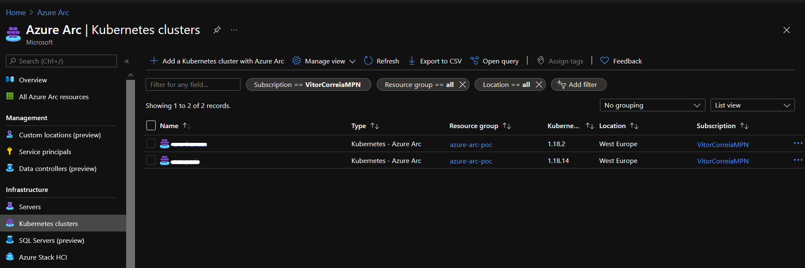
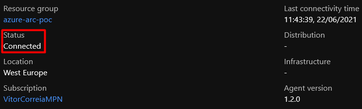

# Connect the Docker Desktop Kubernetes cluster to Azure using Azure Arc

1. Connect the cluster to Azure Arc 

    ```code
    az connectedk8s connect --name Arc-K8S-Demo --resource-group Arc-K8S-Demo-RG --kube-config %HOMEPATH%/.kube/config --kube-context docker-desktop
    ```

2. Search for Azure Arc in the Azure Portal (https://portal.azure.com)

    

3. In the side navigation menu, search for Infrastructure > Kubernetes clusters

    

4. Click the resource that was created and check if the Status property says "Connected"

    