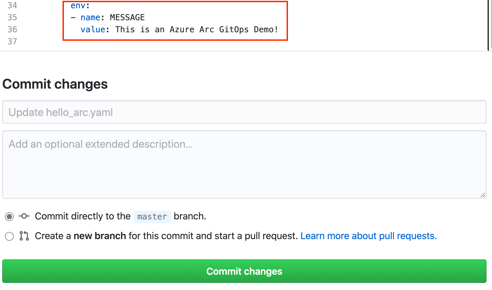

# Deploy GitOps Configuration for Azure Arc

1. First of all, create a namespace in your cluster using kubectl

    ```code
    kubectl create ns cluster-mgmt
    ```

2. Add the official helm stable repo of NGINX ingress controller

    ```code
    helm repo add ingress-nginx https://kubernetes.github.io/ingress-nginx
    helm repo update
    ```

3. Install the chart into the cluster on the previously created namespace

    ```code
    helm install nginx ingress-nginx/ingress-nginx -n cluster-mgmt
    ```

4. Open a powershell prompt and set the following variables

    ```powershell
    $arcClusterName = "Arc-K8S-Demo"
    $resourceGroup = "Arc-K8S-Demo-RG"
    $appClonedRepo = "https://your-forked-repo-here"
    ```

5. Add the GitOps configuration to the Azure Arc resource created

    ```powershell
    az k8s-configuration create `
    --name hello-arc `
    --cluster-name $arcClusterName --resource-group $resourceGroup `
    --operator-instance-name hello-arc --operator-namespace hello-arc `
    --repository-url $appClonedRepo `
    --scope namespace --cluster-type connectedClusters `
    --operator-params="--git-poll-interval 10s --git-readonly --git-path=yaml/"
    ```

6. Check the service of NGINX ingress controller IP Address through K8S Lens or use kubectl

    ```code
    kubectl get svc -n cluster-mgmt
    ```

7. Paste the IP address in your browser and check if the applications responds

8. Now go the "yaml" folder a edit the "hello_arc.yaml" file and change the value of the environment variabled named "MESSAGE"

    

9. Wait for the operator to notice the changes in the manifest files. After 10-30 seconds, refresh the page of the application and you should see the message you changed in the environment variable!