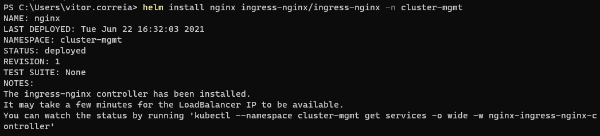
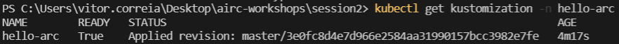

# GitOps Intro Hands-On-Lab

Content

* [GitOps Intro Hands-On-Lab](#gitops-intro-hands-on-lab)
* [GitOps Intro](#gitops-intro)
    * [Abstract and learning objectives](#abstract-and-learning-objectives)
    * [Overview](#overview)
    * [Prerequisites](#prerequisites)
    * [Azure Environment Setup](#azure-environment-setup)
    * [Connect to Azure Arc](#connect-to-azure-arc)
    * [Exercises](#exercises)
        * [Exercise 1: Deploy GitOps Configurations and perform basic GitOps flow](#exercise-1-deploy-gitops-configurations-and-perform-basic-gitops-flow)
        * [Exercise 2: Deploy GitOps Configurations and perform Helm-based GitOps flow](#exercise-2-deploy-gitops-configurations-and-perform-helm-based-gitops-flow)

# GitOps Intro

## Abstract and learning objectives

This lab assumes you have:

* Docker Desktop with Kubernetes feature enabled
* Kubectl
* A GitHub account
* Kubernetes Lens

## Overview

## Prerequisites

1. Fork the [Hello Arc](https://github.com/likamrat/hello_arc) demo application repository.

2. (Optional) Install the “Tab Auto Refresh” extension for your browser. This will help you to show the real-time changes on the application in an automated way.

* [Microsoft Edge](https://microsoftedge.microsoft.com/addons/detail/odiofbnciojkpogljollobmhplkhmofe)
* [Google Chrome](https://chrome.google.com/webstore/detail/tab-auto-refresh/jaioibhbkffompljnnipmpkeafhpicpd?hl=en)
* [Mozilla Firefox](https://addons.mozilla.org/en-US/firefox/addon/tab-auto-refresh/)

3. Install [Chocolatey](https://chocolatey.org/install)

    ```powershell
    Set-ExecutionPolicy Bypass -Scope Process -Force; 

    [System.Net.ServicePointManager]::SecurityProtocol = [System.Net.ServicePointManager]::SecurityProtocol -bor 3072; iex ((New-Object System.Net.WebClient).DownloadString('https://chocolatey.org/install.ps1'))
    ```

4. Use Chocolatey to install Helm 3

    ```code
    choco install kubernetes-helm
    ```

## Azure Environment Setup

1. Sign in into Azure

    ```azurecli-interactive
    az login
    ```

2. Register two resource providers in your subscription (this can take approximately 10 minutes)

    ```azurecli-interactive
    az provider register --namespace Microsoft.Kubernetes
    az provider register --namespace Microsoft.KubernetesConfiguration
    ```

    You can monitor the registration process with the following commands:

    ```azurecli-interactive
    az provider show -n Microsoft.Kubernetes -o table
    az provider show -n Microsoft.KubernetesConfiguration -o table
    ```

3. Install the Azure Arc for Kubernetes CLI extensions

    ```azurecli-interactive
    az extension add --name connectedk8s
    az extension add --name k8s-configuration
    ```

4. Create a resource group, via portal or CLI like this:

    ```azurecli-interactive
    az group create -n Arc-K8S-Demo-RG -l westeurope
    ```

## Connect to Azure Arc

1. Search for Azure Arc in the Azure Portal search bar (https://portal.azure.com)

    

2. In the side navigation menu, search for Infrastructure > Kubernetes clusters. Click in `Add a Kubernetes cluster with Azure Arc`

    

3. Enter the cluster details.
     * Resource Group: Arc-K8S-Demo-RG
     * Cluster name: Arc-K8S-Demo
     * Region: (Europe) West Europe
    </br>
    </br>
    

4. Its a best practice to add tags to your resources in Azure. Ignore the tags tab for now and skip to the next tab!

5. Azure will generate a script based on the values that you entered before. Copy them!

    

6. Open up a powershell prompt and list the available Kubernetes contexts

    ```code
    kubectl config get-contexts
    ```

    

7. Select the context `docker-desktop`

    ```code
    kubectl config set-context docker-desktop
    ```

    

8. Now, you have the right cluster selected. Time to run the script provided by Azure. Paste it in the powershell prompt!

    

    And wait...

9. When the execution of the command finishes, procede to the next step. Azure verifies the connection to your cluster. If the connection was established successfully, click on `Go to the cluster`

    

10. BOOM! Now you can manage your cluster via Azure, using its features! How cool!

## Exercises

The exercises are made to use mostly the command-line. Of course, some of the resources you can create via K8S Lens and via Azure Portal (like the GitOps configurations). We encourage you to try using the command-line first!

### Exercise 1: Deploy GitOps Configurations and perform basic GitOps flow

1. First of all, create a namespace in your cluster using kubectl

    ```code
    kubectl create ns cluster-mgmt
    ```

2. Add the official helm stable repo of NGINX ingress controller

    ```code
    helm repo add ingress-nginx https://kubernetes.github.io/ingress-nginx
    helm repo update
    ```

    

3. Install the NGINX chart into the cluster on the previously created namespace

    ```code
    helm install nginx ingress-nginx/ingress-nginx -n cluster-mgmt
    ```

    


4. Open a powershell prompt and set the following variables

    ```powershell
    $arcClusterName = "Arc-K8S-Demo"
    $resourceGroup = "Arc-K8S-Demo-RG"
    $appClonedRepo = "https://your-forked-repo-here"
    ```

5. Add the GitOps configuration to the Azure Arc resource created

    ```powershell
    az k8s-configuration create `
    --name hello-arc `
    --cluster-name $arcClusterName --resource-group $resourceGroup `
    --operator-instance-name flux --operator-namespace hello-arc `
    --repository-url $appClonedRepo `
    --scope namespace --cluster-type connectedClusters `
    --operator-params="--git-poll-interval 10s --git-readonly --git-path=yaml/"
    ```

    If you go to your Azure Arc Kubernetes resource, to the GitOps blade, you will see that a configuration was created

    

6. Check the deployments created in the cluster, in the `hello-arc` namespace

    ```code
    kubectl get deployment -n hello-arc
    ```

7. You deployed NGINX so you should be able to access the application. Since the cluster is deployed on your machine, the external IP will be, of course, 127.0.0.1 (or localhost)

    In a normal cluster you would check the service of NGINX ingress controller IP Address through `K8S Lens` or use `kubectl`

    ```code
    kubectl get svc -n cluster-mgmt
    ```

7. Paste the IP address in your browser and check if the applications responds

8. Now go the `yaml` folder a edit the `hello_arc.yaml` file and change the value of the environment variabled named `MESSAGE`. Commit the changes to the remote repository.

    

9. Wait for the operator to notice the changes in the manifest files. After 10-30 seconds, refresh the page of the application and you should see the message you changed in the environment variable!

### Exercise 2: Deploy GitOps configurations and perform Helm-based GitOps flow

1. Delete the created configuration in Azure Arc

    ```azurecli-interactive
    az k8s-configuration delete --resource-group Arc-K8S-Demo-RG `
    --cluster-name Arc-K8S-Demo ` 
    --cluster-type connectedClusters `
    --name hello-arc
    ```

2. Check if there are no configurations in the Azure Arc resource

    ```azurecli-interactive
    az k8s-configuration list --resource-group Arc-K8S-Demo-RG `
    --cluster-name my-arc-tutorial-cluster `
    --cluster-type connectedClusters
    ```

    

3. Clean the `hello-arc` environment

    ```code
    kubectl delete namespace hello-arc
    ```

4. Open a powershell prompt and set the following variables

    ```powershell
    $arcClusterName = "Arc-K8S-Demo"
    $resourceGroup = "Arc-K8S-Demo-RG"
    $appClonedRepo = "https://your-forked-repo-here"
    ```

5. Add the GitOps configuration, but this time enable the helm operator

    ```azurecli-interactive
    az k8s-configuration create `
        --name hello-arc `
        --cluster-name $arcClusterName --resource-group $resourceGroup `
        --operator-instance-name flux --operator-namespace prod `
        --enable-helm-operator `
        --helm-operator-params='--set helm.versions=v3' `
        --repository-url $appClonedRepo  `
        --scope namespace --cluster-type connectedClusters `
        --operator-params="--git-poll-interval 10s --git-readonly --git-path=releases/prod"
    ```

6. Check the pods in the `prod` namespace

    ```code
    kubectl get pods -n prod
    ```

    

    or use Lens for more appealing way of exploring your Kubernetes resources

    

7. In a few seconds you should be able to access again 127.0.0.1 (or localhost) in your browser.

8. Now go to the root of the repository and head to `release > prod` and open the `hello-arc.yaml` file and change the following values:

    * Replica count
    * Environment variable `MESSAGE`

    </br>

    

9. After changing the values and committing them, the deployment is scaled to 3 replicas and the message changes to the value you gave it.

    

    

    This happens a few seconds after the commit. It depends in the parameter you passed to the flux operator `git-poll-interval 10s`.
