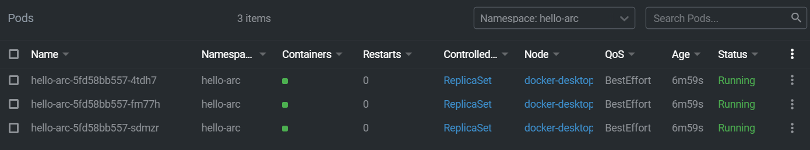

# GitOps Intro Hands-On-Lab

## Content

* [GitOps Intro Hands-On-Lab](#gitops-intro-hands-on-lab)
* [GitOps Intro](#gitops-intro)
    * [Abstract and learning objectives](#abstract-and-learning-objectives)
    * [Overview](#overview)
    * [Prerequisites](#prerequisites)
    * [Installing Flux on Kubernetes](#installing-flux-on-kubernetes)
    * [Exercises](#exercises)
        * [Exercise 1: Deploy GitOps Configurations and perform basic GitOps flow](#exercise-1-deploy-gitops-configurations-and-perform-basic-gitops-flow)
        <!-- * [Exercise 2: Deploy GitOps Configurations and perform Helm-based GitOps flow](#exercise-2-deploy-gitops-configurations-and-perform-helm-based-gitops-flow) -->

# GitOps Intro

## Abstract and learning objectives

This lab assumes you have:

* Docker Desktop with Kubernetes feature enabled or a remote cluster
* Kubectl
* A GitHub account
* Kubernetes Lens

In the end of the lab you will be able to:

* Install Flux in Kubernetes (the operators and the Custom Resource Definitions)
* Create Flux Kustomize configurations to deploy a simple application
* Understand how the pull-based deployments work

## Overview

This container image can be deployed on a Kubernetes cluster. When accessed via a web browser on port 8080, it will display:

    "Hello World" message
    Kubernetes pod name
    Node os information

## Prerequisites

1. Fork the [Hello Arc](https://github.com/likamrat/hello_arc) demo application repository.

2. (Optional) Install the “Tab Auto Refresh” extension for your browser. This will help you to show the real-time changes on the application in an automated way.

* [Microsoft Edge](https://microsoftedge.microsoft.com/addons/detail/odiofbnciojkpogljollobmhplkhmofe)
* [Google Chrome](https://chrome.google.com/webstore/detail/tab-auto-refresh/jaioibhbkffompljnnipmpkeafhpicpd?hl=en)
* [Mozilla Firefox](https://addons.mozilla.org/en-US/firefox/addon/tab-auto-refresh/)

3. Install [Chocolatey](https://chocolatey.org/install)

    ```powershell
    Set-ExecutionPolicy Bypass -Scope Process -Force; 

    [System.Net.ServicePointManager]::SecurityProtocol = [System.Net.ServicePointManager]::SecurityProtocol -bor 3072; iex ((New-Object System.Net.WebClient).DownloadString('https://chocolatey.org/install.ps1'))
    ```

4. Use Chocolatey to install Helm 3

    ```code
    choco install kubernetes-helm
    ```

5. Get the [Flux](https://github.com/fluxcd/flux2) command-line tool. This tutorial shows only how to get it to Windows. 

    > **Note: If you're working with other operating system follow the instructions in the [Flux installation documentation](https://fluxcd.io/docs/installation/#install-the-flux-cli)**.

    5.1. Create a folder at `C:\` named `bin` or use a folder where you store your binary files

    ```code
    mkdir C:\bin
    ```
    
    5.2. Download the lastest version of Flux  [here](https://github.com/fluxcd/flux2/releases). Make sure to download the right zip file regarding the operating system architecture.

    

    5.3. Extract the zip file and move the extracted content to `C:\bin`

    5.4. In the search bar, search for `Edit the system environment variables` and click it.

    5.5. Go to `Environment Variables...`
    
    

    5.6. In the `System variables` list, search for a variable named `Path`, click on it and edit it.

    

    5.7 Click on `New` and add the path that was previously created `C:\bin`.

    

## Installing Flux on Kubernetes

1. Bootstrap Flux using the `flux` command-line tool

    ```powershell
    flux install
    ```

    

    Or using `kubectl`

    ```powershell
    kubectl apply -f https://github.com/fluxcd/flux2/releases/latest/download/install.yaml
    ```

    

## Exercises

The exercises are made to use mostly the command-line. Of course, some of the resources you can create via K8S Lens. We encourage you to try using the command-line first!

### Exercise 1: Deploy GitOps Configurations and perform basic GitOps flow

1. First of all, create a namespace named `cluster-mgmt` in your cluster using kubectl

    ```code
    kubectl create namespace cluster-mgmt
    ```

2. Add the official helm stable repository of NGINX ingress controller

    ```code
    helm repo add ingress-nginx https://kubernetes.github.io/ingress-nginx
    helm repo update
    ```

    

3. Install the NGINX chart into the cluster on the previously created namespace

    ```code
    helm install nginx ingress-nginx/ingress-nginx -n cluster-mgmt
    ```

    

4. Create a namespace named `hello-arc`

    ```powershell
    kubectl create namespace hello-arc
    ```

5. Create a folder in the current working directory named `exercise1/sources`

    ```powershell
    mkdir ./exercise1/sources
    ```

6. Create a `GitRepository` manifest pointing to your fork of `hello-arc` demo application's master branch.

    ```powershell
    flux create source git hello-arc `
        --url=https://github.com/YOUR_GITHUB_USERNAME/hello_arc `
        --branch=master `
        --interval=30s `
        --export > ./exercise1/sources/hello-arc.yaml
    ```

    A file should be created in the directory you created previously `exercise1/sources`. This file represents the source of truth of your infrastructure and you will use it later for creating the application Kubernetes resources.

    

7. Apply the configuration previously created

    ```powershell
    kubectl apply -f ./exercise1/sources/hello-arc.yaml -n hello-arc
    ```

    You can check if the manifest was correctly applied by executing

    ```powershell
    kubectl get gitrepository -n hello-arc
    ```

    

    Or using Kubernetes Lens by going to `Custom Resource Definitions > source.toolkit.fluxcd.io > Gitrepositories`

    

8. Create a folder in the current working directory named `exercise1/sources`

    ```powershell
    mkdir ./exercise1/configurations
    ```

9. Create a Flux Kustomization manifest for your application. This configures Flux to build and apply the manifests located in the directory specified

    ```powershell
    flux create kustomization hello-arc `
        --source=hello-arc `
        --path="./yaml" `
        --prune=true `
        --validation=client `
        --interval=30s `
        -n hello-arc `
        --export > ./exercise1/configurations/hello-arc.yaml
    ```

    > **Note: This tutorial uses `Kustomize` but the forked repository is not prepared for using it. Flux2 now only uses Kustomize but you can target vanilla manifests because the `kustomize-controller` will create the necessary files for you.** 

10. Apply the configuration previously created

    ```powershell
    kubectl apply -f ./exercise1/configurations/hello-arc.yaml -n hello-arc
    ```

    You can check if the manifest was correctly applied by executing

    ```powershell
    kubectl get kustomization -n hello-arc
    ```

    

    Or using Kubernetes Lens by going to `Custom Resource Definitions > kustomize.toolkit.fluxcd.io > Kustomizations`

11. After applying the configuration you can check the tab `Workloads > Pods` and with the `hello-arc` namespace checked you can see that the resources were already created!

    

12. Go to [localhost](http://localhost) in your browser (if using Kubernetes in Docker Desktop) and you can see the application is up and running!

    

13. Now go to the `yaml` folder in your repository and edit the `hello_arc.yaml` file. Change the value of the environment variabled named `MESSAGE`. Commit the changes to the remote repository.

    

14. Wait for the operator to notice the changes in `yaml` folder. After ~30 seconds, refresh the page of the application. You should see the message you changed in the environment variable!

    

<!-- ### Exercise 2: Deploy GitOps configurations and perform Helm-based GitOps flow

1. Create a namespace named `prod`

    ```powershell
    kubectl create namespace prod
    ```

2. Create a folder in the current working directory named `exercise2/configurations`

    ```powershell
    mkdir ./exercise2/configurations
    ```
3. Apply the `GitRepository` configuration previously created in exercise 1

    ```powershell
    kubectl apply -f ./exercise1/sources/hello-arc.yaml -n prod
    ```

    You can check if the manifest was correctly applied by executing

    ```powershell
    kubectl get gitrepository -n prod
    ```

    Or using Kubernetes Lens by going to `Custom Resource Definitions > source.toolkit.fluxcd.io > Gitrepositories`


6. Create a `HelmRelease` manifest pointing to your fork of `hello-arc` demo application's master branch. The source of the helm chart can be referenced in the source resource created in the previous exercise.

    ```powershell
    flux create helmrelease hello-arc `
        --interval=30s `
        --release-name=hello-arc `
        --target-namespace=prod `
        --source=GitRepository/hello-arc `
        --chart=charts/hello-arc `
        --export > ./exercise2/configurations/hello-arc.yaml
    ``` -->